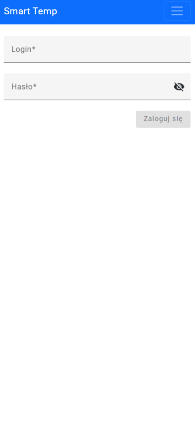
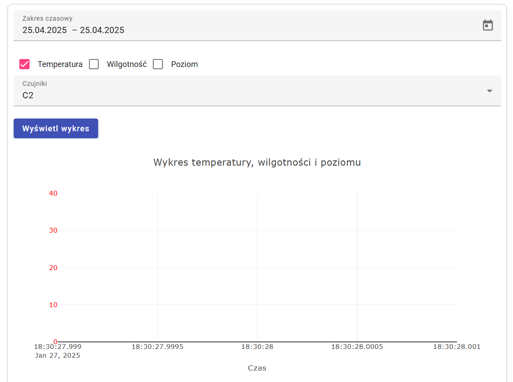
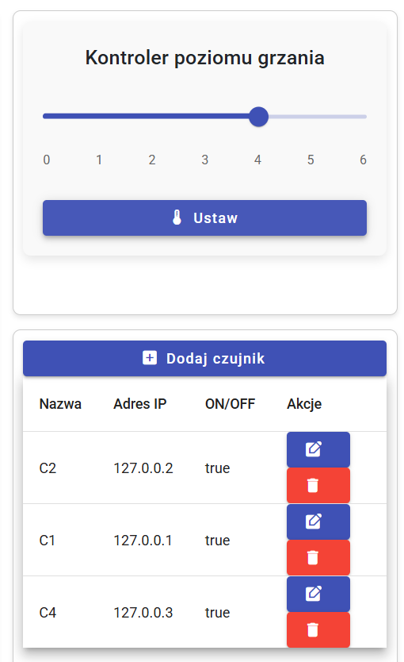
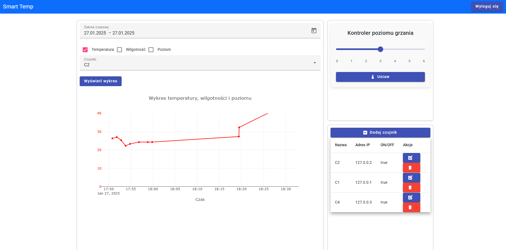

# Smart Temp 🌡️ - Temperature monitoring and control (IoT) system

### 👥 Authors of the completed project:
* [Remigiusz Janicki](https://github.com/TheRemekk) 
* [Wojciech Gunia](https://github.com/wojciechgunia)

## 📖 Table of contents

1. [Description of the project](#l1)
2. [Technologies and functionalities](#l2)
3. [User interface](#l3)
4. [Project structure](#l4)

<a id="l1"></a>
## 📋 Description of the project
This is a web application created using Angular CLI version 15 and Java Spring Boot version 3.1.
It allows users to intuitively monitor and remotely control an IoT system.

The interface includes an interactive graph that provides an overview of temperature, humidity, and heating levels in 
real time and for any selected time interval. Sensors connected to a microcontroller collect the data and send it every minute
via a Wi-Fi connection to a Raspberry Pi device acting as a local server. The read parameters are stored in a relational database.

<a id="l2"></a>

## ⚙️ Technologies and functionalities
* Angular CLI: A front-end development tool that provides rapid development of web applications.
* Spring Boot: Framework used to create a backend and support REST APIs, providing easy configuration and integration with various technologies.
* JPA (Java Persistence API) with Hibernate: Used to map Java objects to database records for convenient data management.
* Flyway: A tool that automates database scheme migration and provides easy management of database structure changes within an application.
* Docker: Used to run a PostgreSQL database in a container, providing environment isolation, easy application configuration, and portability.

<a id="l3"></a>
## 🖥️ User interface:

<details>
  <summary>🔐 Login screen </summary>
  
</details>

<details>
  <summary>📊 Real-time data graph </summary>
  
</details>

<details>
  <summary>🔧 Device control panel </summary>
  
</details>

<details>
  <summary>💻 View of the entire application </summary>
  
</details>

<a id="l4"></a>
## 🧩 Project structure

The following is a simplified structure of the backend made with the Spring Boot Framework, which manages the data sent from the Raspberry Pi device:

```text
📂 SmartTemp # Project files
|_📂 SmartTemp-be   # Backend section
  |_📂 auth     # The module responsible for authorization (necessary to use the interface)
    📂 eureka   # Module that dynamically registers and locates services in the microservices system
    📂 gatway   # Module that manages the API gateway and directs traffic to the appropriate services
    📁 measure  # Module responsible for managing measurements and sensors
    📁 RegisterEndpointInformation  # Module for registering available endpoints
    📄 .gitignore
```
